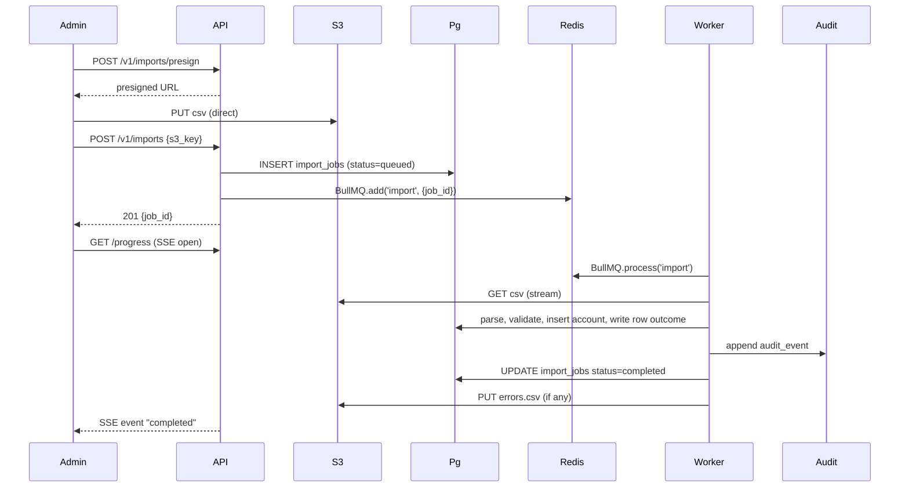

# Design — Bulk CSV import for accounts

**Feature slug:** `bulk-csv-import`
**Status:** Draft
**Date:** 2026-05-04
**Supersedes:** None

## 1. Context

From `01-requirements.md`: tenant admins upload up to 50,000 accounts via CSV, validated and deduped, async-processed with progress and per-row outcomes. Multi-tenant Aurora; SOC 2 audit log required. Out of scope: XLSX, upserts, scheduled imports.

## 2. High-Level Design (HLD)

### 2.1 Component diagram

```mermaid
flowchart LR
  Admin[Tenant Admin via Next.js] --> ALB[ALB]
  ALB --> API[Fastify API service]
  API --> S3[(S3: aurora-imports/{tenant})]
  API --> Pg[(Postgres: import_jobs)]
  API --> Redis[(Redis: BullMQ queue)]
  Worker[BullMQ Worker] --> Redis
  Worker --> S3
  Worker --> Pg
  Worker --> Audit[(Audit log Postgres)]
  Pg -.SSE.-> API
  API -.SSE/poll.-> Admin
```

### 2.2 Service responsibilities

| Service | Responsibility | Owns |
|---|---|---|
| API service | upload endpoint, presigned URL, job lookup, progress SSE | HTTP boundary, request validation, tenant scoping |
| Worker service | parse, validate, dedup, insert, write audit row, write outcome CSV | per-row business logic, idempotency |
| S3 (`aurora-imports/{tenant}/`) | source CSV (input), errors CSV (output) | object storage |
| Postgres (tenant schema) | `import_jobs` table, `accounts` writes | durable state |
| Audit log Postgres | append-only `audit_events` row per job state change | SOC 2 evidence |

### 2.3 Tech stack decisions

- **CSV parser**: `papaparse` (5M+ weekly downloads, MIT, streaming). Alternative `csv-parse` rejected — slightly stricter spec compliance but harder streaming API.
- **Queue**: BullMQ — already in Aurora; per-tenant priority via `priority` field on job.
- **Upload path**: presigned PUT directly to S3 (avoid streaming through API; saves bandwidth + Fargate memory).
- **Progress channel**: Server-Sent Events on `/v1/imports/:id/progress`; falls back to polling if SSE blocked by corporate proxy.

### 2.4 Integration points

- Existing `accounts` table — INSERT-only on this path; no UPDATE.
- Existing `audit_events` table — append rows via existing audit module.
- S3 bucket `aurora-imports` — new bucket, lifecycle rule deletes objects after 30 days (input CSV) and 90 days (errors CSV).

## 3. Low-Level Design (LLD)

### 3.1 Module / package structure

```
src/services/imports/
├── service.ts                    # orchestrates upload -> enqueue
├── handlers/
│   ├── presign.ts                 # POST /v1/imports/presign
│   ├── start.ts                    # POST /v1/imports
│   ├── get.ts                      # GET  /v1/imports/:id
│   └── progress.ts                 # GET  /v1/imports/:id/progress (SSE)
├── workers/
│   └── processImport.ts            # BullMQ job processor
├── parsers/
│   └── csvStream.ts                # papaparse wrapper
├── validators/
│   ├── row.ts                      # zod schemas for an account row
│   └── file.ts                     # size, MIME, header check
├── repository.ts                   # Postgres calls, scoped by tenant
├── types.ts                        # shared types
└── __tests__/                       # tests live here
```

### 3.2 API contracts

#### `POST /v1/imports/presign`
```yaml
summary: Get a presigned S3 PUT URL for the CSV upload
auth: bearer (tenant admin)
request:
  body: { filename: string, size_bytes: int }
responses:
  200: { url, fields, max_size_bytes: 52428800 }
  400: { description: "size > 50MB or filename invalid" }
  401, 403: standard
```

#### `POST /v1/imports`
```yaml
summary: Start an import job from an uploaded S3 object
request:
  body: { s3_key: string, expected_row_count: int? }
responses:
  201: { job_id: uuid, status: "queued" }
  400: { description: "object not found, empty, or > 50MB" }
  409: { description: "tenant has reached parallel-job limit (1 by default)" }
```

#### `GET /v1/imports/:id`
Returns: `{ id, status, total_rows, created_count, skipped_count, errored_count, started_at, completed_at, errors_csv_url? }`

#### `GET /v1/imports/:id/progress`  (SSE)
Streams events: `{ rows_processed, eta_seconds }` every 2 seconds; closes when job is done.

### 3.3 Data model

```sql
-- migration: 2026_05_05_add_import_jobs.sql (per-tenant schema)
CREATE TABLE import_jobs (
  id                   UUID PRIMARY KEY DEFAULT gen_random_uuid(),
  tenant_id            UUID NOT NULL,                       -- redundant for safety
  initiated_by_user_id UUID NOT NULL,
  s3_key               TEXT NOT NULL,
  file_sha256          TEXT NOT NULL,
  total_rows           INT,
  created_count        INT NOT NULL DEFAULT 0,
  skipped_count        INT NOT NULL DEFAULT 0,
  errored_count        INT NOT NULL DEFAULT 0,
  status               TEXT NOT NULL CHECK (status IN ('queued','running','completed','failed','cancelled')),
  errors_s3_key        TEXT,
  started_at           TIMESTAMPTZ,
  completed_at         TIMESTAMPTZ,
  created_at           TIMESTAMPTZ NOT NULL DEFAULT now()
);
CREATE INDEX import_jobs_tenant_status_idx ON import_jobs (tenant_id, status, created_at DESC);

-- staging table for per-row outcomes during a run (truncated after job completes; rows kept as outcome CSV)
CREATE UNLOGGED TABLE import_job_rows (
  job_id    UUID NOT NULL,
  row_no    INT NOT NULL,
  outcome   TEXT NOT NULL CHECK (outcome IN ('created','skipped','error')),
  message   TEXT,
  PRIMARY KEY (job_id, row_no)
);
```

**Migration plan**: forward = additive (CREATE TABLE only, no existing-row backfill). Rollback = `DROP TABLE import_jobs, import_job_rows`. Safe to deploy any time.

### 3.4 Sequence diagrams



### 3.5 Configuration / environment variables

| Variable | Purpose | Default |
|---|---|---|
| `IMPORTS_S3_BUCKET` | bucket name | `aurora-imports-${env}` |
| `IMPORTS_MAX_BYTES` | per-file size cap | `52428800` (50MB) |
| `IMPORTS_MAX_ROWS` | per-file row cap | `50000` |
| `IMPORTS_MAX_CELL_BYTES` | per-cell size cap (anti-bomb) | `4096` |
| `IMPORTS_TENANT_PARALLEL` | jobs-in-flight per tenant | `1` |
| `IMPORTS_WORKER_CONCURRENCY` | global worker concurrency | `8` |

## 4. ADR — CSV-only with hard caps, sync upload + async processing

- **Status**: Proposed
- **Context**: We need to support 50K-row imports without blowing Fargate memory or starving the BullMQ pool for other tenants.
- **Decision**: Direct-to-S3 presigned PUT (avoid API memory pressure); BullMQ async processing with per-tenant parallelism cap of 1 (avoid hot-tenant queue starvation); papaparse for streaming parse.
- **Alternatives considered**:
  1. **Sync inline processing for files <500 rows** — rejected. Inconsistent UX (sometimes wait, sometimes background) is worse than always-async.
  2. **Buffer entire file in API memory then parse** — rejected. 50MB CSV with 50K rows blows past Fargate task memory at higher concurrency.
  3. **JSONL upload format** — rejected. Customers export from Salesforce / HubSpot / spreadsheets; CSV is the lingua franca.
- **Consequences**:
  - (+) Bounded memory footprint, predictable cost, fair scheduling.
  - (+) Reuses existing S3 + BullMQ patterns.
  - (-) UX always shows a "processing" state even for tiny files (~5 second floor).
  - Supersedes: none.

## 5. First-pass threat model (STRIDE)

| Component | Spoofing | Tampering | Repudiation | Info disclosure | DoS | Elevation |
|---|---|---|---|---|---|---|
| Presign endpoint | JWT auth bound to tenant | presigned URL signed by AWS | audit_events row | URL leaks expose only one bucket key | rate limit per tenant | scope check on tenant id |
| Direct S3 PUT | bound by presigned URL | size/MIME enforced server-side post-upload | S3 access logs | bucket private; presigned URL TTL 5 min | size cap 50MB | n/a |
| Worker | BullMQ token | signed S3 read | audit_events on completion | tenant scoping in repo layer | worker concurrency cap | tenant-id from job, not from CSV |
| Audit log | append-only, separate schema | no UPDATE/DELETE | n/a | restricted role | n/a | n/a |

Full review in stage 5 (`sdlc-security`).

## 6. Open questions

- Should we offer a "test upload" mode that validates without writing? Could add a `?dry_run=true` flag — defer to v2.
- Outcome CSV retention: 90 days proposed. Compliance to confirm against GDPR data subject deletion rights.
- Should one-tenant-one-job limit be configurable per tenant tier (free=1, enterprise=5)? Defer.

## 7. Hand-off

Next stage: **Development** (`sdlc-development`). Artifact: `03-development.md`.
